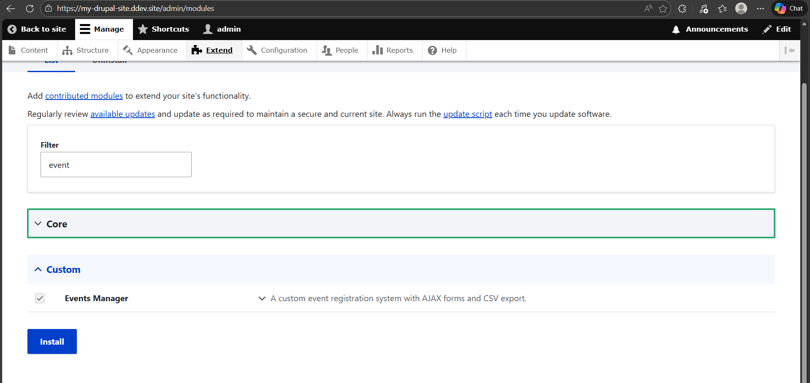
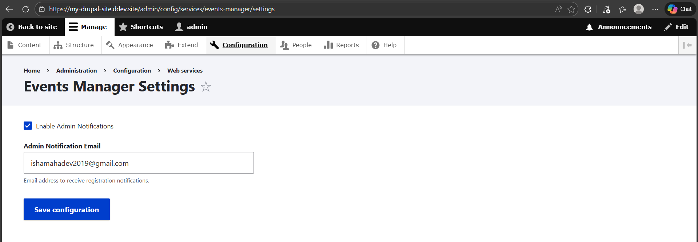
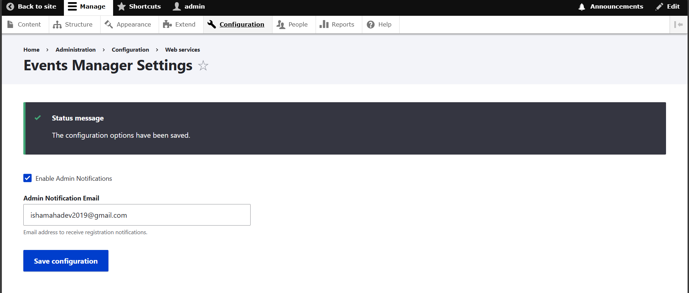
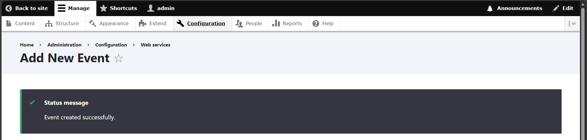
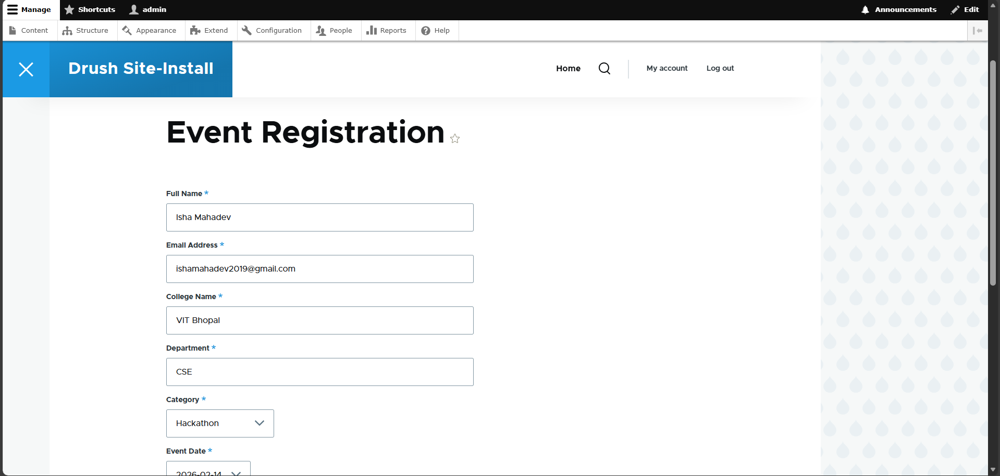
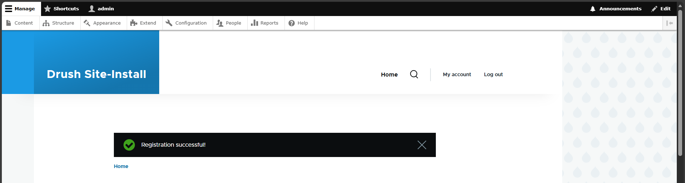
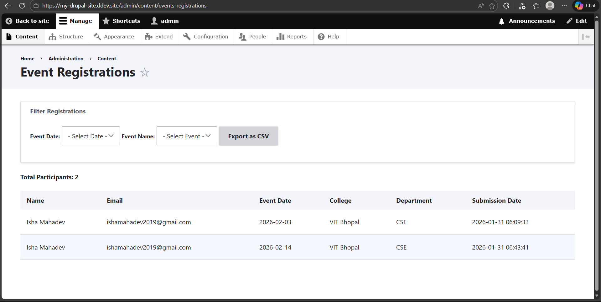
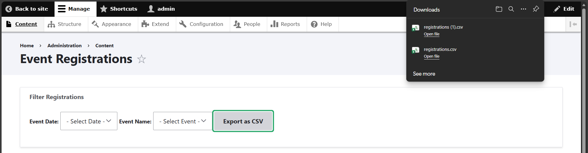
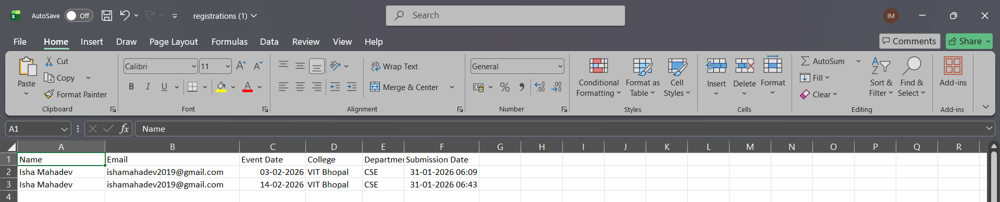

# Events Manager Module

A custom Drupal 10 module for managing event registrations. This module allows admins to create events and users to register for them via a custom form. It includes AJAX-dependent fields, CSV export capabilities, and email notifications.

---

## 📌 Features

### 1. Data Storage (Custom Database)
The module stores data in two custom database tables:
* **`events_manager_event`**: Stores event configuration (ID, Name, Category, Dates).
* **`events_manager_registration`**: Stores user registrations with a foreign key linking to the event.

### 2. Email Notifications (Drupal Mail API)
Sends automated confirmation emails using the Drupal Mail API:
* **To User**: Confirms their registration with details (Name, Event Name, Date, Category).
* **To Admin**: Notifies the administrator of a new signup (configurable).

### 3. Configuration Page (Config API)
An admin interface to:
* Enable/Disable admin notifications.
* Set the Admin Notification Email address.
* *Note: Uses Drupal Config API (no hard-coded values).*

### 4. Admin Listing Page
A dedicated dashboard for administrators to:
* **Filter** registrations by Date and Event Name (using AJAX).
* **View** participant counts.
* **Export** the filtered list to CSV.
* **Secure** access restricted by custom permissions.

---

## 🚀 Installation & Setup

### Step 1: Create the Folder Structure
Navigate to your Drupal project's `web/modules` directory and create the folder structure as shown below:
`web/modules/custom/events_manager`


### Step 2: Add Module Files
Place all the module files (`.info.yml`, `.module`, `src/`, etc.) into this directory.

### Step 3: Enable the Module
You can enable the module using Drush or the Drupal Admin Interface.

**Option A: Using Drush (Recommended)**
Open your terminal in the project root and run:
```bash
ddev drush en events_manager -y

---

## Screenshots of Execution

### 1. Enable Module


### 2. Configuration: Configure Global Settings



### 3. Usage: Add Event Page



### 4. Usage: Event Registration Page



### 5. Admin Management: View Event Registrations


### 6. Admin Management: Export Data

